# Database Entity-Relationship Diagram

**Task 98 - Database Schema Complete Extraction**  
**Date:** 2025-01-21

## Complete ER Diagram (Mermaid Format)

```mermaid
erDiagram
    %% Core Admin Tables
    admin_settings {
        TEXT key PK
        TEXT value
    }
    
    %% Company Tables
    companies {
        INTEGER id PK
        TEXT name UK
        TEXT logo_base64
        TEXT street
        TEXT zip_code
        TEXT city
        TEXT phone
        TEXT email
        TEXT website
        INTEGER is_default
        TEXT created_at
        TEXT updated_at
    }
    
    company_documents {
        INTEGER id PK
        INTEGER company_id FK
        TEXT doc_type
        TEXT display_name
        TEXT file_name
        TEXT absolute_file_path
        TIMESTAMP uploaded_at
    }
    
    company_text_templates {
        INTEGER id PK
        INTEGER company_id FK
        TEXT template_key
        TEXT template_text
        TEXT created_at
        TEXT updated_at
    }
    
    company_image_templates {
        INTEGER id PK
        INTEGER company_id FK
        TEXT template_key
        BLOB image_data
        TEXT created_at
        TEXT updated_at
    }
    
    %% PDF Templates
    pdf_templates {
        INTEGER id PK
        TEXT template_type
        TEXT name
        TEXT content
        BLOB image_data
        TEXT created_at
        TEXT updated_at
    }
    
    %% Product Tables
    products {
        INTEGER id PK
        TEXT category
        TEXT manufacturer
        TEXT model_name UK
        REAL price_euro
        TEXT datasheet_link
        TEXT image_url
        TEXT specifications
        TEXT created_at
        TEXT updated_at
    }
    
    heat_pumps {
        INTEGER id PK
        TEXT model_name UK
        TEXT manufacturer
        REAL heating_capacity_kw
        REAL cop_rating
        REAL price_euro
        TEXT datasheet_link
        TEXT specifications
        TEXT created_at
        TEXT updated_at
    }
    
    services {
        INTEGER id PK
        TEXT name
        TEXT description
        REAL price_euro
        TEXT category
        INTEGER is_active
        TIMESTAMP created_at
        TIMESTAMP updated_at
    }
    
    brand_logos {
        INTEGER id PK
        TEXT brand_name UK
        TEXT logo_base64
        TEXT logo_url
        TIMESTAMP created_at
        TIMESTAMP updated_at
    }
    
    %% CRM Core Tables
    customers {
        INTEGER id PK
        TEXT salutation
        TEXT title
        TEXT first_name
        TEXT last_name
        TEXT company_name
        TEXT street
        TEXT zip_code
        TEXT city
        TEXT phone
        TEXT mobile
        TEXT email
        TEXT notes
        TIMESTAMP created_at
        TIMESTAMP updated_at
        TEXT lead_source
        TEXT lead_status
        TEXT assigned_to
        TEXT last_contact_date
        TEXT next_follow_up_date
        REAL customer_value
        TEXT tags
    }
    
    projects {
        INTEGER id PK
        INTEGER customer_id FK
        TEXT project_name
        TEXT project_type
        TEXT status
        TIMESTAMP created_at
        TIMESTAMP updated_at
        TEXT project_data
        TEXT notes
    }
    
    customer_documents {
        INTEGER id PK
        INTEGER customer_id FK
        INTEGER project_id FK
        TEXT doc_type
        TEXT display_name
        TEXT file_name
        TEXT absolute_file_path
        TIMESTAMP uploaded_at
    }
    
    project_calculations {
        INTEGER id PK
        INTEGER project_id FK
        INTEGER customer_id FK
        INTEGER version
        TEXT calculation_data
        TEXT calculation_type
        INTEGER is_main_offer
        TIMESTAMP created_at
        TEXT created_by
        TEXT notes
    }
    
    %% CRM Activity Tables
    crm_tasks {
        INTEGER id PK
        TEXT title
        TEXT description
        INTEGER customer_id FK
        INTEGER project_id FK
        TEXT assigned_to
        TEXT due_date
        TEXT priority
        TEXT status
        TIMESTAMP created_at
        TIMESTAMP completed_at
    }
    
    crm_activities {
        INTEGER id PK
        INTEGER customer_id FK
        INTEGER project_id FK
        TEXT activity_type
        TEXT subject
        TEXT description
        TEXT created_by
        TIMESTAMP created_at
    }
    
    crm_reminders {
        INTEGER id PK
        TEXT reminder_type
        INTEGER customer_id FK
        INTEGER project_id FK
        TEXT reminder_date
        TEXT message
        INTEGER is_sent
        TIMESTAMP created_at
    }
    
    %% CRM Tags
    crm_tags {
        INTEGER id PK
        TEXT name UK
        TEXT color
        TEXT description
        TIMESTAMP created_at
    }
    
    customer_tags {
        INTEGER id PK
        INTEGER customer_id FK
        INTEGER tag_id FK
        TIMESTAMP created_at
    }
    
    %% CRM Leads and Appointments
    crm_leads {
        INTEGER id PK
        TEXT company_name
        TEXT contact_person
        TEXT email
        TEXT phone
        TEXT lead_source
        TEXT lead_status
        TEXT pipeline_stage
        REAL estimated_value
        INTEGER probability
        TEXT expected_close_date
        TEXT assigned_to
        TEXT notes
        TIMESTAMP created_at
        TIMESTAMP updated_at
        INTEGER converted_to_customer_id FK
    }
    
    crm_appointments {
        INTEGER id PK
        TEXT title
        TEXT description
        TEXT start_datetime
        TEXT end_datetime
        TEXT location
        INTEGER customer_id FK
        INTEGER project_id FK
        TEXT assigned_to
        TEXT appointment_type
        TEXT status
        INTEGER reminder_minutes
        TIMESTAMP created_at
    }
    
    %% Dashboard and Settings
    user_dashboard_settings {
        INTEGER id PK
        TEXT user_id UK
        TEXT widget_config
        TIMESTAMP created_at
        TIMESTAMP updated_at
    }
    
    %% Sales Forecasting
    sales_targets {
        INTEGER id PK
        TEXT target_name
        TEXT target_period
        TEXT start_date
        TEXT end_date
        REAL target_revenue
        INTEGER target_units
        TEXT assigned_to
        TEXT notes
        TIMESTAMP created_at
        TIMESTAMP updated_at
    }
    
    sales_forecasts {
        INTEGER id PK
        INTEGER target_id FK
        TEXT forecast_date
        REAL forecasted_revenue
        INTEGER forecasted_units
        TEXT confidence_level
        TEXT notes
        TIMESTAMP created_at
    }
    
    %% Knowledge Base
    kb_categories {
        INTEGER id PK
        TEXT name
        INTEGER parent_id FK
        TEXT description
        INTEGER sort_order
        TIMESTAMP created_at
    }
    
    kb_articles {
        INTEGER id PK
        TEXT title
        TEXT content
        INTEGER category_id FK
        TEXT author
        TEXT status
        INTEGER view_count
        TIMESTAMP created_at
        TIMESTAMP updated_at
    }
    
    kb_ratings {
        INTEGER id PK
        INTEGER article_id FK
        INTEGER rating
        TEXT feedback
        TEXT user_id
        TIMESTAMP created_at
    }
    
    %% Relationships
    companies ||--o{ company_documents : "has"
    companies ||--o{ company_text_templates : "has"
    companies ||--o{ company_image_templates : "has"
    
    customers ||--o{ projects : "has"
    customers ||--o{ customer_documents : "has"
    customers ||--o{ project_calculations : "has"
    customers ||--o{ crm_tasks : "assigned"
    customers ||--o{ crm_activities : "has"
    customers ||--o{ crm_reminders : "has"
    customers ||--o{ customer_tags : "tagged"
    customers ||--o| crm_leads : "converted_from"
    customers ||--o{ crm_appointments : "scheduled"
    
    projects ||--o{ customer_documents : "contains"
    projects ||--o{ project_calculations : "has"
    projects ||--o{ crm_tasks : "related"
    projects ||--o{ crm_activities : "related"
    projects ||--o{ crm_reminders : "related"
    projects ||--o{ crm_appointments : "related"
    
    crm_tags ||--o{ customer_tags : "applied_to"
    
    sales_targets ||--o{ sales_forecasts : "has"
    
    kb_categories ||--o{ kb_categories : "parent_of"
    kb_categories ||--o{ kb_articles : "contains"
    
    kb_articles ||--o{ kb_ratings : "rated"
```




## Relationship Cardinality

### One-to-Many Relationships

| Parent Table | Child Table | Relationship | Foreign Key |
|--------------|-------------|--------------|-------------|
| companies | company_documents | 1:N | company_id |
| companies | company_text_templates | 1:N | company_id |
| companies | company_image_templates | 1:N | company_id |
| customers | projects | 1:N | customer_id |
| customers | customer_documents | 1:N | customer_id |
| customers | project_calculations | 1:N | customer_id |
| customers | crm_tasks | 1:N | customer_id |
| customers | crm_activities | 1:N | customer_id |
| customers | crm_reminders | 1:N | customer_id |
| customers | crm_appointments | 1:N | customer_id |
| projects | customer_documents | 1:N | project_id |
| projects | project_calculations | 1:N | project_id |
| projects | crm_tasks | 1:N | project_id |
| projects | crm_activities | 1:N | project_id |
| projects | crm_reminders | 1:N | project_id |
| projects | crm_appointments | 1:N | project_id |
| crm_tags | customer_tags | 1:N | tag_id |
| sales_targets | sales_forecasts | 1:N | target_id |
| kb_categories | kb_articles | 1:N | category_id |
| kb_articles | kb_ratings | 1:N | article_id |

### One-to-One Relationships

| Table 1 | Table 2 | Relationship | Foreign Key |
|---------|---------|--------------|-------------|
| crm_leads | customers | 1:1 (optional) | converted_to_customer_id |

### Many-to-Many Relationships

| Table 1 | Junction Table | Table 2 | Description |
|---------|----------------|---------|-------------|
| customers | customer_tags | crm_tags | Customer tagging system |

### Self-Referencing Relationships

| Table | Relationship | Foreign Key | Description |
|-------|--------------|-------------|-------------|
| kb_categories | 1:N (hierarchical) | parent_id | Category hierarchy |

## Domain Groupings

### 1. Admin & Configuration Domain
- admin_settings
- companies
- company_documents
- company_text_templates
- company_image_templates
- pdf_templates
- user_dashboard_settings

### 2. Product Catalog Domain
- products
- heat_pumps
- services
- brand_logos

### 3. CRM Core Domain
- customers
- projects
- customer_documents
- project_calculations

### 4. CRM Activity Domain
- crm_tasks
- crm_activities
- crm_reminders
- crm_appointments

### 5. CRM Sales Domain
- crm_leads
- crm_tags
- customer_tags
- sales_targets
- sales_forecasts

### 6. Knowledge Base Domain
- kb_categories
- kb_articles
- kb_ratings

## Data Flow Patterns

### Customer Lifecycle
```
crm_leads → customers → projects → project_calculations → customer_documents
    ↓           ↓           ↓
crm_tasks   crm_activities  crm_reminders
```

### Document Management Flow
```
customers → customer_documents ← projects
companies → company_documents
```

### Tagging System Flow
```
crm_tags → customer_tags ← customers
```

### Knowledge Base Flow
```
kb_categories (parent) → kb_categories (child) → kb_articles → kb_ratings
```

## Orphan Detection Queries

### Find Orphaned Company Documents
```sql
SELECT cd.id, cd.display_name
FROM company_documents cd
LEFT JOIN companies c ON cd.company_id = c.id
WHERE c.id IS NULL;
```

### Find Orphaned Customer Documents
```sql
SELECT cd.id, cd.display_name
FROM customer_documents cd
LEFT JOIN customers c ON cd.customer_id = c.id
WHERE c.id IS NULL;
```

### Find Orphaned Projects
```sql
SELECT p.id, p.project_name
FROM projects p
LEFT JOIN customers c ON p.customer_id = c.id
WHERE c.id IS NULL;
```

### Find Orphaned Project Calculations
```sql
SELECT pc.id
FROM project_calculations pc
LEFT JOIN projects p ON pc.project_id = p.id
WHERE p.id IS NULL;
```

