# System Architecture Diagrams

## Table of Contents

1. [High-Level System Architecture](#high-level-system-architecture)
2. [Component Interaction Diagram](#component-interaction-diagram)
3. [Data Flow Diagram](#data-flow-diagram)
4. [Deployment Diagram](#deployment-diagram)
5. [Security Architecture Diagram](#security-architecture-diagram)
6. [Integration Architecture](#integration-architecture)

## High-Level System Architecture

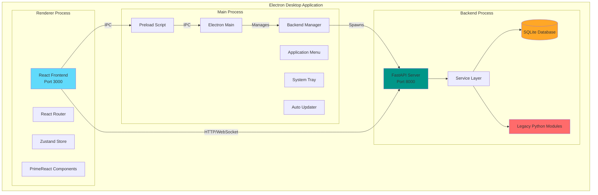

## Component Interaction Diagram

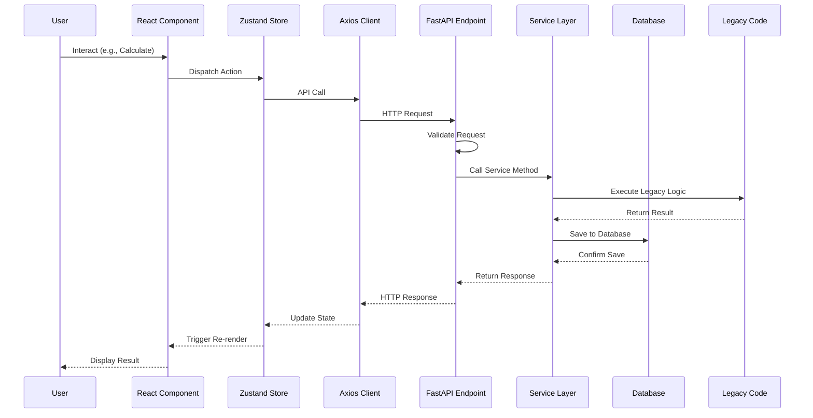

## Data Flow Diagram

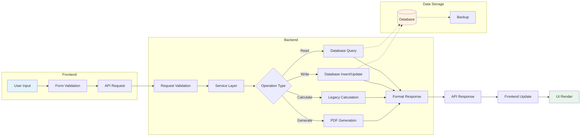

## Deployment Diagram

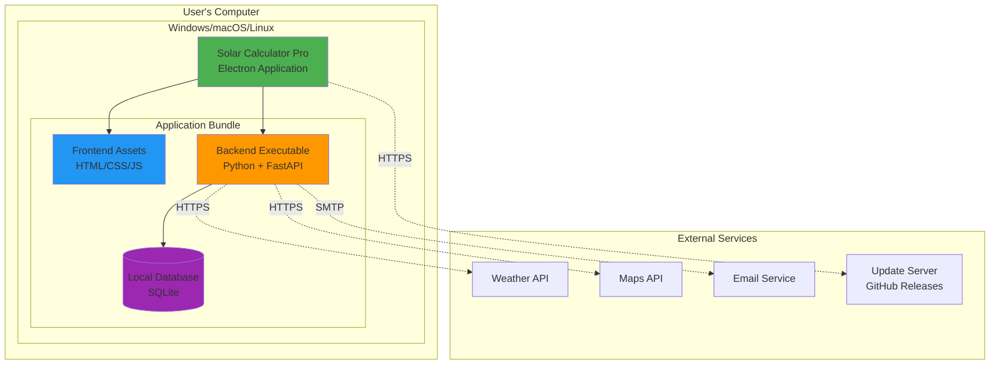

## Security Architecture Diagram

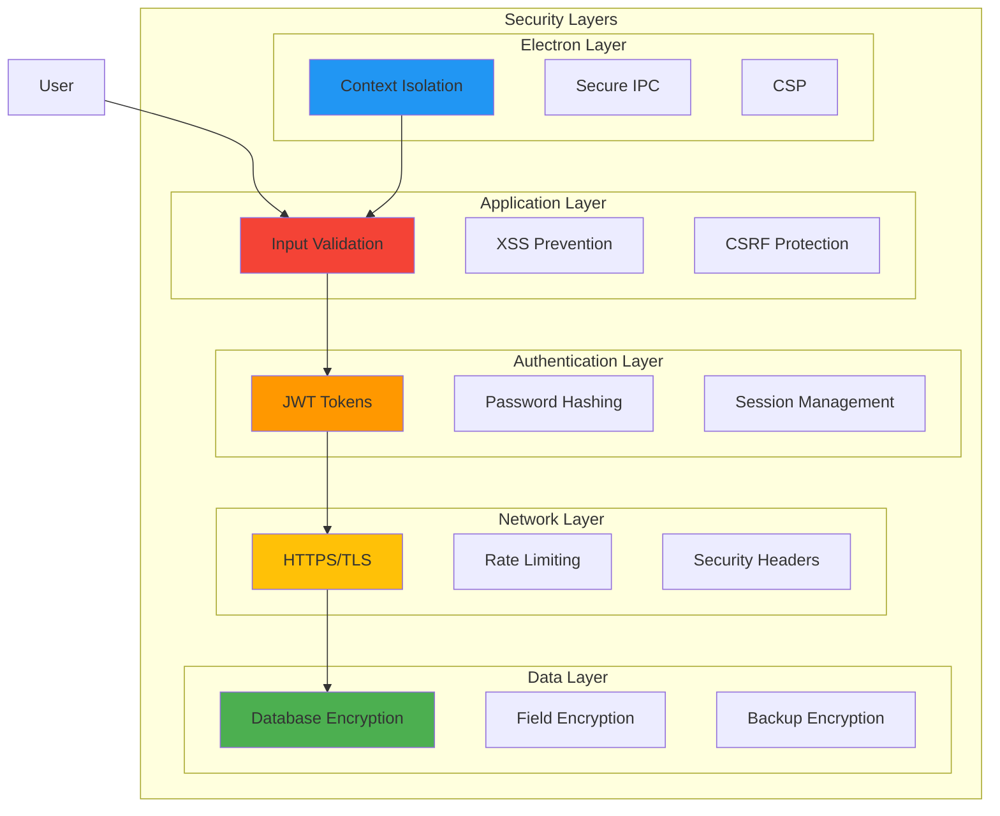

## Integration Architecture

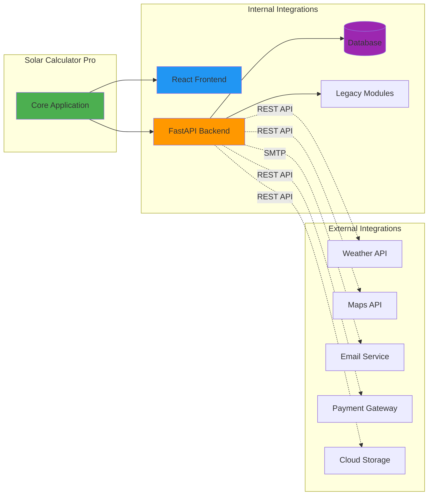

## Authentication Flow Diagram

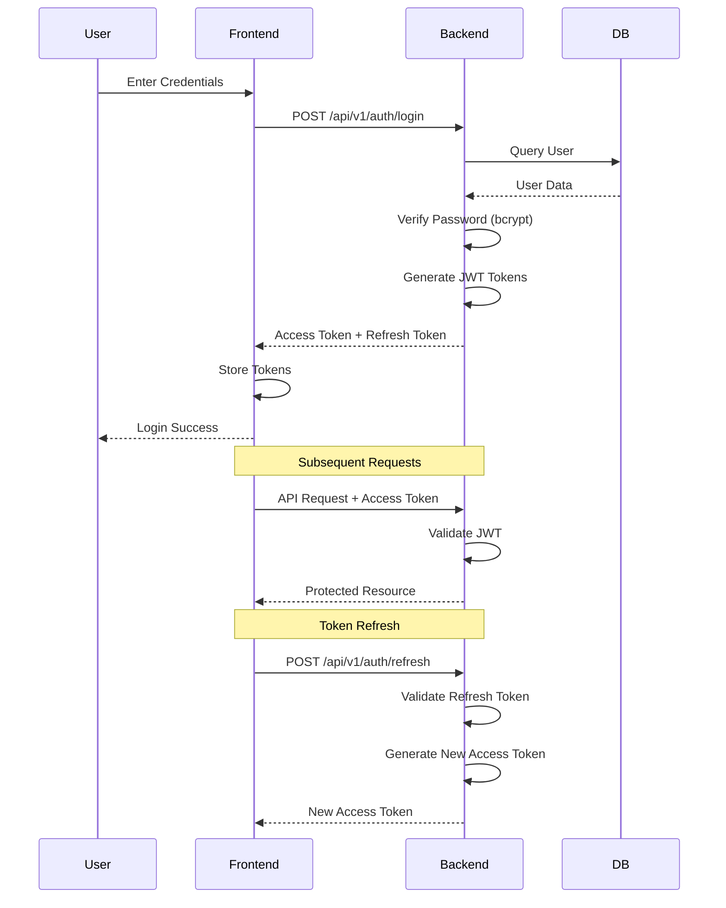

## Calculation Flow Diagram

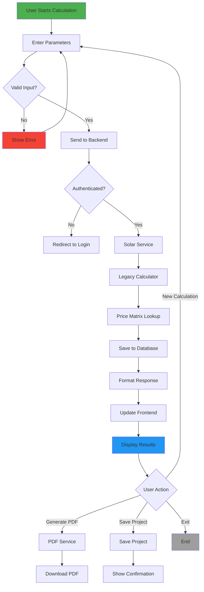

## WebSocket Real-Time Communication

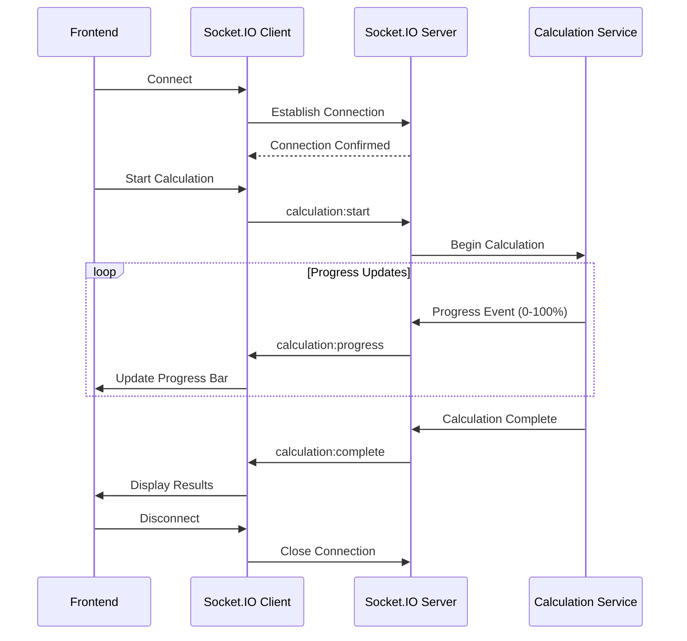

## Database Schema Diagram

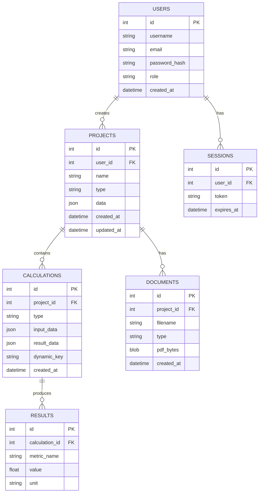

## Electron Process Architecture

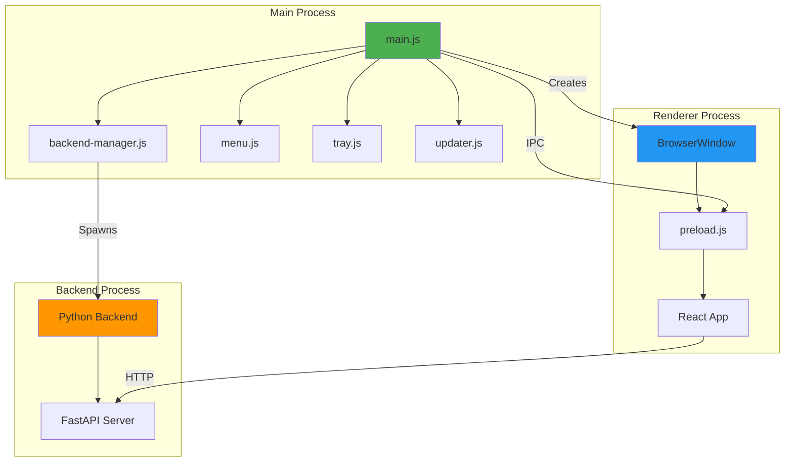

## Summary

These diagrams provide visual representations of:

- **System Architecture**: Overall structure and components
- **Component Interactions**: How components communicate
- **Data Flow**: How data moves through the system
- **Deployment**: How the application is deployed
- **Security**: Security layers and mechanisms
- **Integration**: Internal and external integrations
- **Authentication**: User authentication flow
- **Calculations**: Calculation process flow
- **Real-Time**: WebSocket communication
- **Database**: Data model relationships
- **Electron**: Process architecture

All diagrams use Mermaid syntax and can be rendered in any Markdown viewer that supports Mermaid.
